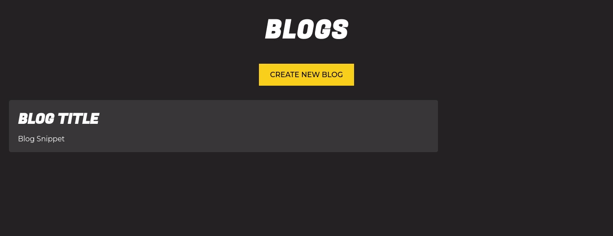

# Blog Platform with Node.js, Express, and MongoDB



Welcome to the Blog Platform repository! This project showcases the creation of a versatile blog platform using Node.js, Express, MongoDB, and the EJS view engine. The platform empowers users to create, read, and delete blog posts.

## Features

- **Create, Read, Delete:** An intuitive interface for composing, viewing, and managing blog posts.
- **Dynamic Rendering:** Utilizes EJS view engine for dynamic content rendering.
- **Efficient Data Management:** Seamlessly stores and retrieves data with MongoDB using Mongoose

`The primary focus here lies in building a  backend structure. 
`

## How to Run Locally

1. Clone the repository: `https://github.com/liaqatXD/Blog-Platform-with-Node.js-Express-and-MongoDB.git`
2. Navigate to the project directory
3. Install dependencies: `npm install`
4. **Configure Database**: In the `app.js` file, locate the `dbURI` constant and assign your database URL. Whether you're using a local or cloud database, update this value accordingly.

   ```javascript
   const dbURI = "your-database-url"; // Replace with your database URL
   ```
